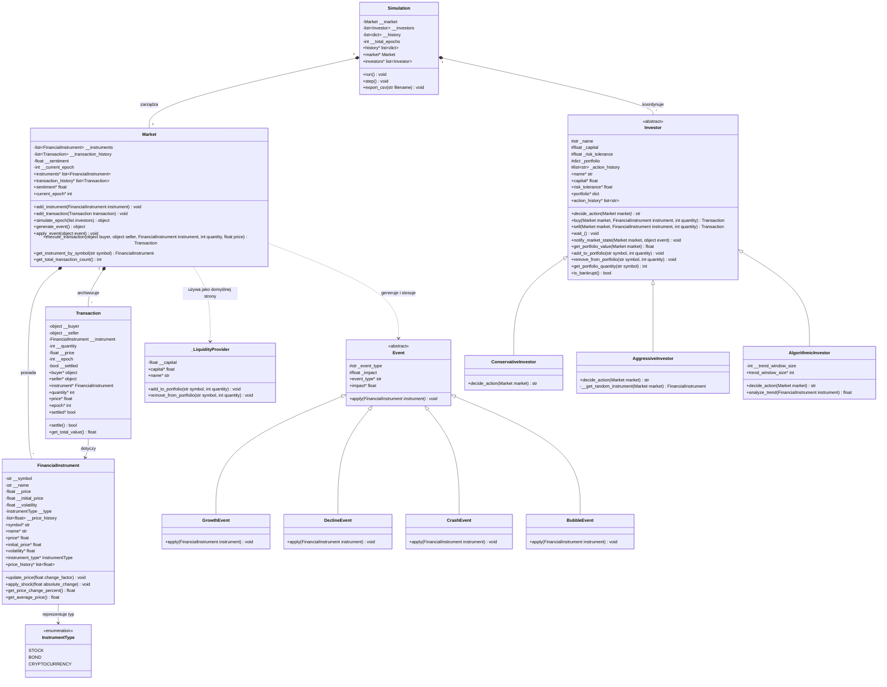
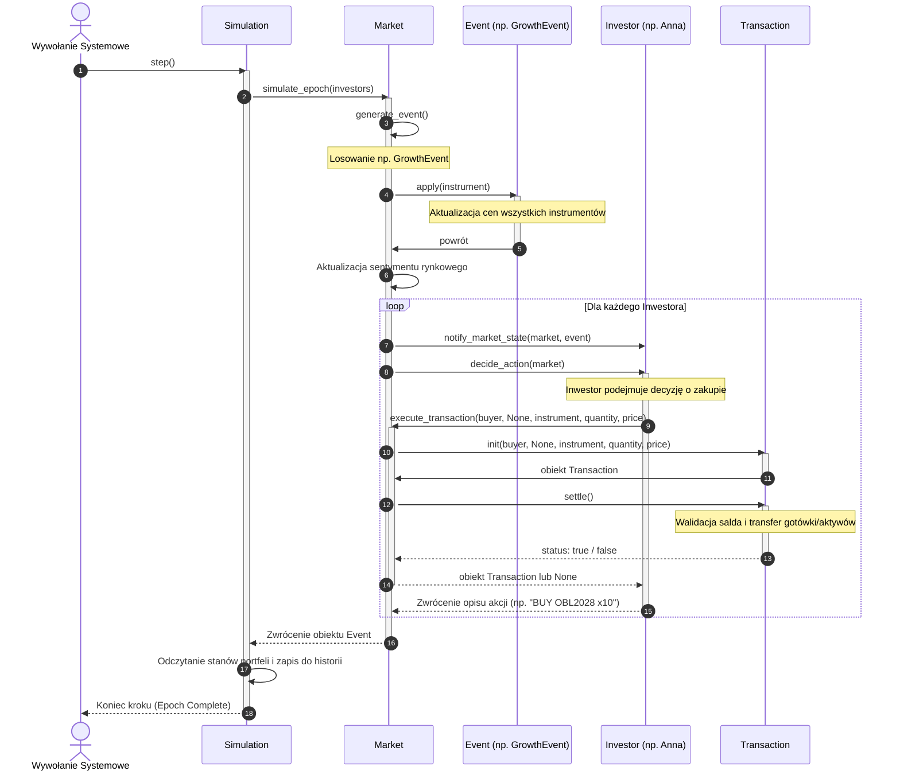
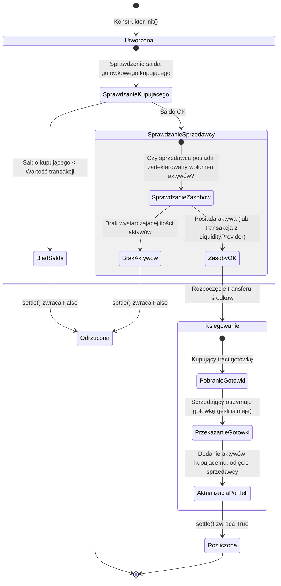

# Dokumentacja Projektu: Symulacja Rynku Finansowego
## 1. Temat Projektu
**Temat:** Symulacja Rynku Finansowego z Dynamicznym Behawioralnym Podejściem Inwestorów (ang. *Financial Market Simulation with Dynamic Behavioral Approach of Investors*).
Projekt ma na celu modelowanie zachowań rynkowych instrumentów finansowych o zróżnicowanej charakterystyce (akcje, obligacje, kryptowaluty) pod wpływem losowych zdarzeń makroekonomicznych (wzrosty, spadki, krachy, bańki spekulacyjne) oraz interakcji z inwestorami reprezentującymi różne strategie inwestycyjne (konserwatywną, agresywną, algorytmiczną).
---
## 2. Skład Grupy Projektowej
Poniższa tabela przedstawia strukturę zespołu projektowego zaangażowanego w realizację systemu symulacji:

| Imię i Nazwisko | Rola w Zespole |
| :--- | :--- |
| **Aliaksei Huryn** | **Lider Zespołu** |
| **Pavel Dounar** | **Członek Zespołu** |
---
## 3. Opis Zadania Symulacji w Języku Naturalnym
Symulacja odtwarza działanie giełdy w ujęciu dyskretnym, podzielonym na **epoki (kroki czasowe)**. 
### Główne komponenty systemu:
1. **Rynek (Market):** Serce symulacji, które przechowuje zarejestrowane instrumenty finansowe oraz historię przeprowadzonych transakcji. Odpowiada za koordynację zmian cenowych i rozliczanie zleceń.
2. **Instrumenty Finansowe (Financial Instruments):**
   * **AAPL (Akcja):** Umiarkowany wzrost i ryzyko (zmienność 15%).
   * **OBL2028 (Obligacja skarbowa):** Bardzo bezpieczny instrument o niskiej zmienności (3%).
   * **BTC (Kryptowaluta):** Instrument o ekstremalnym potencjale zysku/straty i wysokiej zmienności (45%).
3. **Inwestorzy (Investors):** Reprezentują unikalne style podejmowania decyzji finansowych:
   * **Anna (Inwestor Konserwatywny):** Preferuje minimalizację ryzyka. Inwestuje głównie w bezpieczne obligacje skarbowe (OBL2028) o ile ogólny sentyment rynkowy nie jest skrajnie negatywny. W przypadku głębokiego kryzysu wyprzedaje część aktywów, by chronić kapitał.
   * **Bartek (Inwestor Agresywny):** Działa pod wpływem emocji i przypadku. Dokonuje częstych, losowych transakcji (kupno/sprzedaż) o zróżnicowanym wolumenie (od 5 do 15 jednostek), co generuje dużą płynność, ale niesie wysokie ryzyko strat.
   * **Algo1 (Inwestor Algorytmiczny):** Podąża za trendami technicznymi na podstawie krótkoterminowego okna cenowego (ostatnie 3 epoki). Jeśli instrument wykazuje silny trend wzrostowy (>5%), automatycznie kupuje pakiet 10 jednostek. Jeśli trend spada poniżej -5%, błyskawicznie sprzedaje posiadane zasoby, by zminimalizować straty (tzw. mechanizm *Stop Loss*).
### Przebieg epoki symulacji:
W każdej epoce wykonywana jest ściśle określona sekwencja działań:
1. **Zdarzenie Rynkowe (Market Event):** Rynek generuje losowe zdarzenie makroekonomiczne:
   * *GROWTH (Wzrost)* lub *DECLINE (Spadek)* - umiarkowanie zmieniające ceny aktywów.
   * *BUBBLE (Bańka)* lub *CRASH (Krach)* - wywołujące gwałtowne wstrząsy cenowe o dużej sile (szczególnie wpływające na kryptowaluty).
2. **Aktualizacja cen i sentymentu:** Wszystkie instrumenty dostosowują swoje ceny zgodnie z charakterystyką zdarzenia i własną wbudowaną zmiennością. Rynek wylicza nowy **sentyment ogólny** (wskaźnik od -1.0 do 1.0).
3. **Decyzje Inwestorów:** Każdy inwestor analizuje stan rynku oraz swoje zasoby:
   * Decyduje o zakupie lub sprzedaży określonego wolumenu instrumentu.
   * Transakcje mogą być zawierane z automatycznym dostawcą płynności (Market) lub bezpośrednio między inwestorami (w przypadku sprzedaży posiadanych aktywów).
4. **Rozliczanie Transakcji (Settlement):** Transakcja jest zatwierdzana tylko wtedy, gdy kupujący posiada odpowiednią ilość gotówki, a sprzedawca posiada deklarowane aktywa. Następuje natychmiastowy transfer środków oraz jednostek portfela.
5. **Rejestracja Historii (Logging):** Na koniec każdej epoki system zapisuje szczegółowe statystyki: aktualne ceny instrumentów, sentyment oraz **całkowitą wartość portfela każdego inwestora (Net Worth = gotówka + aktywa \* aktualna cena)** oraz ich rezerwy gotówkowe. Dane te są na koniec eksportowane do pliku CSV.
---
## 4. Diagram Klas
Poniższy diagram Mermaid przedstawia strukturę klas systemu, ich atrybuty, metody oraz relacje (dziedziczenie, asocjację i powiązania wyliczeniowe):

---
## 5. Diagram Obiektów
Poniższy diagram przedstawia migawkę (ang. *snapshot*) stanu obiektów w pamięci podczas trwania **Epoki 1** po wykonaniu pierwszych zakupów przez inwestorów:
```mermaid
objectDiagram
    object Simulation_Inst {
        __total_epochs = 20
        __history_len = 1
    }
    
    object Market_Inst {
        __sentiment = 0.05
        __current_epoch = 1
    }
    
    object AAPL_Stock {
        __symbol = "AAPL"
        __price = 192.94
        __volatility = 0.15
        __type = InstrumentType.STOCK
    }
    
    object OBL_Bond {
        __symbol = "OBL2028"
        __price = 105.47
        __volatility = 0.03
        __type = InstrumentType.BOND
    }
    
    object Anna_Investor {
        _name = "Anna"
        _capital = 13915.67
        _risk_tolerance = 0.2
        _portfolio = {"OBL2028": 10}
    }
    
    object Bartek_Investor {
        _name = "Bartek"
        _capital = 31240.97
        _risk_tolerance = 0.8
        _portfolio = {"OBL2028": 7}
    }
    
    object Algo1_Investor {
        _name = "Algo1"
        _capital = 48013.23
        _risk_tolerance = 0.5
        _portfolio = {"AAPL": 10}
    }
    
    object Trans_1 {
        __quantity = 10
        __price = 105.47
        __settled = true
    }
    Simulation_Inst --> Market_Inst : zarządza
    Simulation_Inst --> Anna_Investor : koordynuje
    Simulation_Inst --> Bartek_Investor : koordynuje
    Simulation_Inst --> Algo1_Investor : koordynuje
    Market_Inst --> AAPL_Stock : zawiera
    Market_Inst --> OBL_Bond : zawiera
    Anna_Investor --> Trans_1 : dokonała zakupu
    Trans_1 --> OBL_Bond : kupiony instrument
```
---
## 6. Diagram Sekwencji
Poniższy diagram obrazuje przepływ wywołań metod i interakcję między obiektami w trakcie wykonywania pojedynczej epoki symulacji (`Simulation.step()`):

---
## 7. Diagram Maszyny Stanów (Cykl Życia Transakcji)
Poniższy diagram przedstawia stany i przejścia, przez które przechodzi obiekt klasy `Transaction` od momentu jego utworzenia do ostatecznego rozstrzygnięcia:

---
## 8. Dokumentacja Wygenerowana na Podstawie Komentarzy w Kodzie
Poniższa sekcja stanowi referencyjną dokumentację API napisaną w standardzie Doxygen/Sphinx na podstawie komentarzy w kodzie źródłowym projektu.
### 8.1. Pakiet `simulation`
#### Klasa `Simulation`
Kontroluje epoki symulacji, historię stanów i eksport wyników do pliku CSV.
*   `__init__(self, total_epochs: int = 20) -> None`
    *   **Opis:** Inicjalizuje symulację, tworzy obiekty rynku, instrumentów finansowych (AAPL, OBL2028, BTC) oraz inwestorów (Anna, Bartek, Algo1).
    *   **Argumenty:**
        *   `total_epochs` (*int*): Liczba epok do wykonania.
    *   **Wyjątki:**
        *   `ValueError`: Jeśli `total_epochs` jest liczbą ujemną lub równą zero.
*   `run(self) -> None`
    *   **Opis:** Uruchamia wszystkie epoki w sekwencji, wywołując metodę `step()` dla każdego kroku.
*   `step(self) -> None`
    *   **Opis:** Wykonuje pojedynczą epokę symulacji. Aktualizuje ceny instrumentów poprzez losowe zdarzenie, zbiera decyzje inwestorów, przeprowadza transakcje i dołącza nowy wpis podsumowujący (wycena portfeli netto, stany gotówki) do historii.
*   `export_csv(self, filename: str) -> None`
    *   **Opis:** Eksportuje pełną historię symulacji do zewnętrznego pliku CSV.
    *   **Argumenty:**
        *   `filename` (*str*): Ścieżka docelowa pliku wyjściowego.
*   *Właściwości (Properties):*
    *   `history` (*list[dict]*): Zwraca kopię historii symulacji.
    *   `market` (*Market*): Zwraca referencję do głównego obiektu rynku.
    *   `investors` (*list[Investor]*): Zwraca kopię listy zarejestrowanych inwestorów.
---
### 8.2. Pakiet `market`
#### Klasa `FinancialInstrument`
Model domenowy reprezentujący pojedynczy instrument finansowy podlegający obrotowi giełdowemu.
*   `__init__(self, symbol: str, name: str, initial_price: float, volatility: float, instrument_type: InstrumentType) -> None`
    *   **Opis:** Inicjalizuje instrument z ceną bazową, poziomem wbudowanej zmienności oraz przypisaną kategorią aktywów.
    *   **Wyjątki:**
        *   `ValueError`: Jeśli `initial_price <= 0` lub `volatility` wykracza poza zamknięty przedział `[0.0, 1.0]`.
*   `update_price(self, change_factor: float) -> None`
    *   **Opis:** Aktualizuje bieżącą cenę instrumentu o relatywny współczynnik zmiany (np. `0.05` oznacza wzrost o 5%). Zapewnia ochronę ceny przed spadkiem poniżej minimalnej wartości `0.01`.
*   `apply_shock(self, absolute_change: float) -> None`
    *   **Opis:** Aktualizuje cenę o bezwzględną kwotę zmiany (np. `-15.0` to obniżka ceny o 15 jednostek pieniężnych).
*   `get_price_change_percent(self) -> float`
    *   **Opis:** Zwraca całkowitą procentową zmianę ceny instrumentu w odniesieniu do jego ceny początkowej.
*   `get_average_price(self) -> float`
    *   **Opis:** Zwraca średnią arytmetyczną wszystkich zarejestrowanych cen w pełnej historii instrumentu.
#### Klasa `Market`
Koordynator stanu rynku finansowego, zarządzający instrumentami, transakcjami oraz sentymentem.
*   `add_instrument(self, instrument: FinancialInstrument) -> None`
    *   **Opis:** Rejestruje nowy instrument finansowy na rynku.
*   `simulate_epoch(self, investors: list) -> object`
    *   **Opis:** Wykonuje pełną epokę symulacji. Generuje losowe zdarzenie makroekonomiczne, stosuje jego wpływ do instrumentów, aktualizuje sentyment rynkowy, a następnie pobiera i wykonuje akcje dla każdego z inwestorów.
    *   **Zwraca:** Instancję wygenerowanego zdarzenia (`Event`).
*   `generate_event(self) -> object`
    *   **Opis:** Losuje zdarzenie makroekonomiczne na podstawie wag prawdopodobieństwa (40% Growth, 35% Decline, 10% Crash, 15% Bubble).
*   `apply_event(self, event) -> None`
    *   **Opis:** Przekazuje zdarzenie do wszystkich instrumentów celem modyfikacji cen oraz modyfikuje sentyment rynku w zakresie `[-1.0, 1.0]`.
*   `execute_transaction(self, buyer, seller, instrument, quantity: int, price: float) -> Transaction`
    *   **Opis:** Tworzy, podejmuje próbę rozliczenia i rejestruje transakcję giełdową. W przypadku braku bezpośredniego sprzedawcy (`seller = None`), transakcja zawierana jest z domyślnym dostawcą płynności (`_LiquidityProvider`).
#### Klasa `Transaction`
Opisuje i realizuje pojedynczą operację handlową kupna/sprzedaży.
*   `settle(self) -> bool`
    *   **Opis:** Przeprowadza walidację warunków transakcji. Jeśli kupujący posiada gotówkę, a sprzedawca aktywa, wykonuje transfer gotówki oraz przenosi prawo własności instrumentów w portfelach.
    *   **Zwraca:** `True` jeśli transakcja została sfinalizowana, `False` w przypadku odrzucenia.
*   `get_total_value(self) -> float`
    *   **Opis:** Wylicza całkowitą wartość transakcji (`wolumen * cena jednostkowa`).
---
### 8.3. Pakiet `investor`
#### Klasa `Investor` (klasa abstrakcyjna)
Definiuje stan (imię, gotówka, tolerancja ryzyka, posiadane aktywa) oraz wspólny interfejs handlowy dla wszystkich strategii inwestycyjnych.
*   `decide_action(self, market: Market) -> str` (*metoda abstrakcyjna*)
    *   **Opis:** Podejmuje autonomiczną decyzję o inwestycji i uruchamia operację kupna lub sprzedaży w bieżącej epoce.
*   `buy(self, market: Market, instrument: FinancialInstrument, quantity: int) -> Transaction`
    *   **Opis:** Wysyła żądanie kupna określonej liczby jednostek instrumentu z rynku.
*   `sell(self, market: Market, instrument: FinancialInstrument, quantity: int) -> Transaction`
    *   **Opis:** Wysyła żądanie sprzedaży określonej liczby posiadanych jednostek na rynku.
*   `get_portfolio_value(self, market: Market) -> float`
    *   **Opis:** Wylicza całkowitą wartość netto inwestora (kapitał gotówkowy + suma wartości wszystkich posiadanych aktywów wycenianych po bieżących cenach rynkowych).
#### Klasa `ConservativeInvestor`
Inwestor o niskiej tolerancji ryzyka (`risk_tolerance = 0.2`).
*   **Logika działania:** Kupuje paczki 10 sztuk obligacji skarbowych (`OBL2028`), jeśli sentyment rynkowy jest stabilny lub pozytywny (`sentiment >= -0.15`). W przypadku głębokiego krachu (`sentiment < -0.3`) panikuje i wyprzedaje po 5 sztuk posiadanych obligacji, celem ochrony wolnych środków.
#### Klasa `AggressiveInvestor`
Inwestor o wysokiej tolerancji ryzyka (`risk_tolerance = 0.8`), handlujący chaotycznie.
*   **Logika działania:** W 50% przypadków kupuje losowy instrument o zmiennej wielkości z przedziału `[5, 15]`, ograniczonej zdolnością płatniczą. W 30% przypadków sprzedaje losowo wybrane aktywo ze swojego portfela w ilości `[5, 15]` (nie przekraczając stanu posiadania).
#### Klasa `AlgorithmicInvestor`
Inwestor kierujący się analizą techniczną trendu krótkookresowego.
*   **Logika działania:** Analizuje ceny z ostatnich 3 epok. Jeśli dla dowolnego instrumentu trend ceny rośnie o ponad `5%`, kupuje pakiet 10 jednostek. Jeśli trend spada poniżej `-5%` i posiada dany instrument, natychmiast sprzedaje pakiet 10 sztuk w celu ochrony kapitału.
---
### 8.4. Pakiet `event`
#### Klasa `Event` (klasa abstrakcyjna)
Klasa bazowa dla zdarzeń rynkowych, charakteryzujących się typem zdarzenia oraz siłą relatywnego wpływu (`impact`).
*   `apply(self, instrument: FinancialInstrument) -> None` (*metoda abstrakcyjna*)
    *   **Opis:** Zmienia cenę wybranego instrumentu na podstawie specyfiki zdarzenia makroekonomicznego.
#### Klasy szczegółowe zdarzeń:
1.  **`GrowthEvent`**: Generuje stabilne wzrosty (`impact` losowany z przedziału `[2%, 8%]`). Zwiększa cenę instrumentów o wartość zależną od ich zmienności.
2.  **`DeclineEvent`**: Generuje umiarkowane spadki cen (`impact` losowany z przedziału `[-1%, -5%]`). Modyfikuje cenę z uwzględnieniem zmienności instrumentu.
3.  **`CrashEvent`**: Wywołuje nagłe, głębokie spadki na rynku (`impact` losowany z przedziału `[-8%, -20%]`). Najmocniej uderza w kryptowaluty (mnożnik wpływu `2.0`), najmniej w obligacje skarbowe (mnożnik `0.3`).
4.  **`BubbleEvent`**: Generuje gwałtowne spekulacyjne wzrosty cen aktywów (`impact` losowany z przedziału `[10%, 25%]`). Powoduje gigantyczne wzrosty cen kryptowalut (mnożnik wpływu `3.0`) oraz stabilne zachowanie obligacji (mnożnik `0.1`).